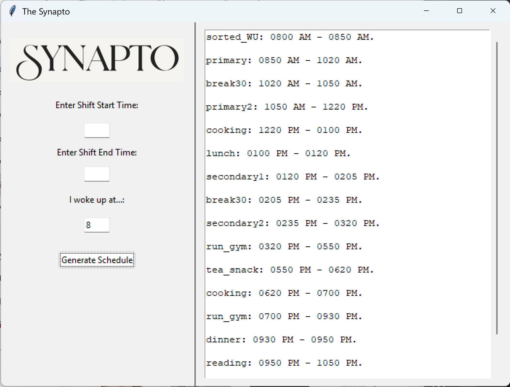

# Synapto: Intelligent Shift Planner

YouTube Video Demo: [https://youtu.be/h8JcKI6n43Y
](https://youtu.be/OywEHweN51M)
GitHub Repository: [https://github.com/captabs1988/cs50-final-project]

## Inspiration

As someone who lives with ADHD, I understand how difficult it can be to plan out your day without feeling overwhelmed. ADHD brains often struggle to bridge the gap between intention and action — the prefrontal cortex may plan, but the older parts of the brain tend to hijack focus or motivation. 

Synapto is my attempt to bridge that gap.

The app is named after the "synapse" — where brain signals travel — and is inspired by the idea of offloading the mental strain of scheduling to a visual, structured guide. It's not meant to be rigid or prescriptive, but rather a helpful starting point — a visual cue that makes routines feel achievable, not chaotic.

My goal was to build a tool that gives people with ADHD a clear, low-friction way to start their day — especially during the first 10 seconds of indecision where overwhelm kicks in. 

Synapto provides a draft schedule that users can follow loosely or strictly — either way, it reduces decision fatigue and helps get things moving.



## Description
Synapto is a Python desktop application using `tkinter` that allows users to generate shift schedules based on shift start and end times. It features a GUI for user input and returns structured, phase-based schedules tailored for productivity.

## How It Works 💡
You can either:
- Enter a wake-up time to generate a full-day flow
- Or enter a shift start and end time to generate a custom pre-/post-shift schedule

## How to Run
Make sure you have Python 3 installed. Run the program using:

```bash
python project.py
```

## Features
- Accepts time input in both 24-hour and AM/PM formats
- Generates pre-shift and post-shift routines based on your input
- Displays results in a human-readable schedule format
- Uses `tkinter` for a simple and interactive desktop GUI
- Includes optional unit testing using `pytest`

## Files
- `project.py`: The main GUI application
- `test_project.py`: Unit tests using `pytest` (optional)

## 🧑‍🏫 User Manual

This application provides a **general daily scheduling guideline**. The idea is not to enforce a strict timetable but to offer a draft that users can:
- Adapt to their day based on energy levels and priorities
- Follow directly if it aligns with their needs ("if the shoe fits, wear it")

Below is a breakdown of **phases** used in the schedule to help users understand the intent and flow of each time block:

### ☀️ Wake-Up Types
- **express_WU**: Express Wake-Up — user wakes up, takes a quick bath, wears uniform, grabs coffee or breakfast from a cafe, and eats while commuting.
- **sorted_WU**: Sorted Wake-Up — user wakes up, cooks breakfast at home, takes a bath, wears uniform, and walks to the station in a more settled routine.

### 🚆 Commute
- **the_tfl**: A default 90-minute commute, inspired by London's Transport for London (TFL). Meant for cities where the commute is long.
- **express_tfl**: A quicker 70-minute commute, used when the user rushes out with minimal preparation and catches the train within 10 minutes.

### 🍽 Meals
- **breakfast**: 25-minute morning meal, usually when not going to work.
- **lunch**: 20-minute midday meal.
- **dinner**: 20-minute evening meal.
- **tea_snack**: A 30-minute tea or light snack break in the evening.

### 💼 Work Phases
- **primary**: 90-minute session for deep, focused work on the main project (e.g., studying Python).
- **primary2**: Second deep work session after a break, continuing the same primary task.
- **secondary1** and **secondary2**: 45-minute sessions for smaller, flexible tasks (e.g., learning editing or camera work). These are optional and less urgent.

### 💻 Other Activities
- **coding**: Dedicated block to practice or build with code.

### 🏃‍♂️ Health & Fitness
- **run_gym**: Full gym or running session (150 minutes).
- **run_gym_short**: Condensed gym or run session (under 80 minutes).

### 🛌 Rest & Recharge
- **post_shift**: Wind-down phase after returning from a work shift.
- **break30 / break20**: General-purpose rest breaks of 30 or 20 minutes respectively.
- **reading**: 1-hour reading session.
- **sleep**: Sleep phase, ideally starting with a 4-7-8 breathing technique for relaxation.

### 🌙 Night Shift Prep
- **pre_night_shift_ritual**: A 30-minute preparation window before heading for a night shift — includes meals or planning for food options during shift.
